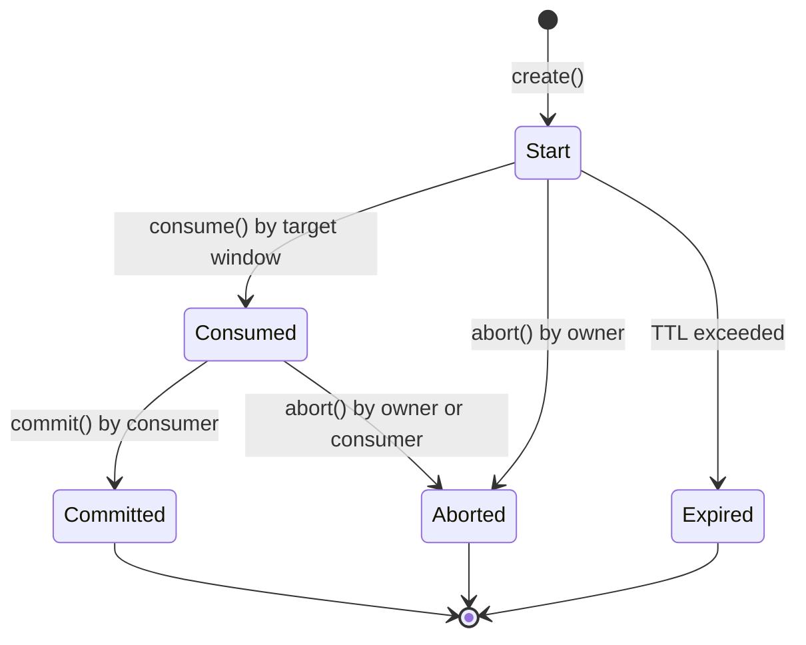
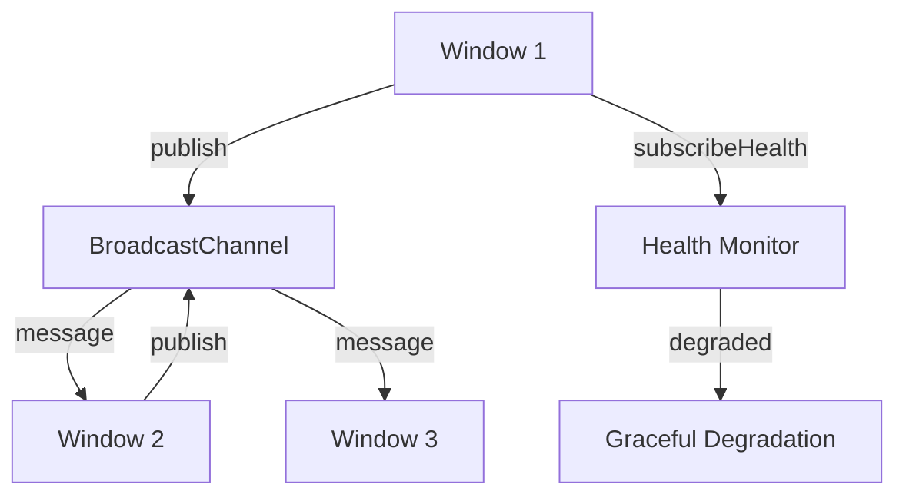

# Bridge System

## Design Philosophy

The bridge system enables cross-window communication for multi-window shell instances. It uses `BroadcastChannel` as the transport layer, providing selection sync, context sync, popout management, and drag-and-drop session brokering across windows. The design is resilient — it degrades gracefully when `BroadcastChannel` is unavailable and includes health monitoring.

## Key Package

**`@ghost-shell/bridge`** — Window bridge, async bridge adapter, DnD session broker, payload builders.

## Window Bridge

The core transport layer:

```typescript
// packages/bridge/src/window-bridge.ts
export interface WindowBridge {
  readonly available: boolean;
  publish(event: WindowBridgeEvent): boolean;
  subscribe(listener: (event: WindowBridgeEvent) => void): () => void;
  subscribeHealth(listener: (health: WindowBridgeHealth) => void): () => void;
  recover(): void;
  close(): void;
}

export function createWindowBridge(channelName: string): WindowBridge;
```

### Event Types

All cross-window events are a discriminated union:

```typescript
export type WindowBridgeEvent =
  | SelectionSyncEvent      // Entity selection changes
  | ContextSyncEvent        // Lane value changes
  | PopoutRestoreRequestEvent  // Popout → host restore
  | TabCloseSyncEvent       // Tab closed in another window
  | DndSessionUpsertEvent   // DnD session created/consumed
  | DndSessionDeleteEvent   // DnD session committed/aborted
  | SyncProbeEvent          // Health probe
  | SyncAckEvent;           // Health probe response
```

### Health Monitoring

```typescript
export interface WindowBridgeHealth {
  degraded: boolean;
  reason: "unavailable" | "channel-error" | "publish-failed" | null;
}
```

The bridge tracks health state and notifies subscribers. On successful message receipt, health resets to non-degraded.

## Async Bridge

A transport-agnostic async adapter with richer semantics:

```typescript
// packages/bridge/src/async-bridge.ts
export interface AsyncWindowBridge {
  readonly available: boolean;
  publish(event: WindowBridgeEvent, options?: AsyncWindowBridgePublishOptions): Promise<AsyncWindowBridgePublishResult>;
  subscribe(listener: (event: WindowBridgeEvent) => void): () => void;
  subscribeHealth(listener: (health: AsyncWindowBridgeHealth) => void): () => void;
  recover(): Promise<void>;
  close(): void;
}

export type AsyncWindowBridgePublishResult =
  | { status: "accepted"; disposition: "enqueued" }
  | { status: "rejected"; reason: AsyncWindowBridgeRejectReason };
```

`createAsyncWindowBridgeCompatibilityShim()` wraps a sync `WindowBridge` into the async contract with monotonic health sequence numbers.

## DnD Session Broker

Cross-window drag-and-drop coordination:

```typescript
// packages/bridge/src/dnd-session-broker.ts
export interface DragSessionBroker {
  readonly available: boolean;
  create(payload: unknown, ttlMs?: number): DragSessionRef | null;
  consume(ref: DragSessionRef, consumedByWindowId?: string): unknown | null;
  commit(ref: DragSessionRef, consumedByWindowId?: string): boolean;
  abort(ref: DragSessionRef, sourceWindowId?: string): boolean;
  pruneExpired(now?: number): number;
  dispose(): void;
}
```

### DnD Session Lifecycle



### Protocol Details

- Sessions have a TTL (default 60s, minimum enforced by `MIN_TTL_MS`)
- Each session has a `correlationId` for tracing
- `ownerWindowId` tracks which window created the session
- `consumedByWindowId` tracks which window claimed the payload
- Terminal states are remembered briefly to reject late-arriving messages
- Expired sessions are pruned on every operation

### Cross-Window Sync

The broker subscribes to bridge events and mirrors session state:

```
Window A (owner)                    Window B (consumer)
─────────────────                   ─────────────────
create(payload)
  → publish dnd-session-upsert
                                    receives upsert → stores session
                                    consume(ref)
                                      → publish dnd-session-upsert (lifecycle: "consume")
receives consume → updates state
                                    commit(ref)
                                      → publish dnd-session-delete (lifecycle: "commit")
receives delete → removes session
```

## Data Flow



## Extension Points

- **Custom event types**: The bridge transport is generic — new event types can be added to the discriminated union.
- **Alternative transports**: Implement `AsyncWindowBridge` for non-BroadcastChannel transports (e.g., SharedWorker, WebSocket).
- **Payload builders**: `buildSelectionSyncEvent()` and `buildGroupContextSyncEvent()` provide typed event construction.

## File Reference

| File | Responsibility |
|---|---|
| `packages/bridge/src/window-bridge.ts` | `WindowBridge`, `createWindowBridge`, event types |
| `packages/bridge/src/window-bridge-parse.ts` | `parseBridgeEvent` — safe event deserialization |
| `packages/bridge/src/async-bridge.ts` | `AsyncWindowBridge`, compatibility shim |
| `packages/bridge/src/window-bridge-scomp.ts` | Scomp-based async bridge variant |
| `packages/bridge/src/dnd-session-broker.ts` | `DragSessionBroker`, `createDragSessionBroker` |
| `packages/bridge/src/dnd-session-broker-protocol.ts` | Session protocol helpers, pruning, correlation |
| `packages/bridge/src/bridge-payloads.ts` | Typed event builders |
