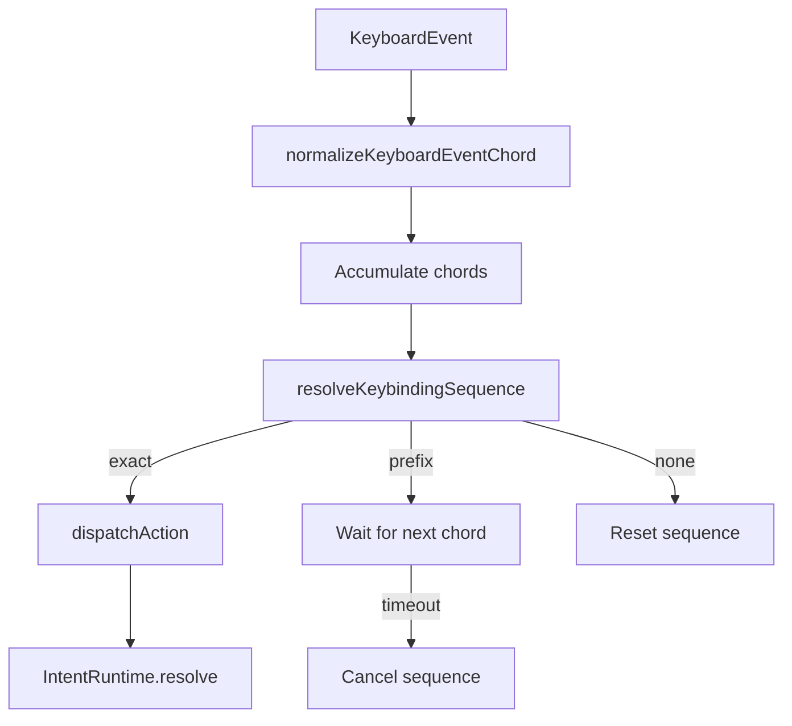

# Command System

## Design Philosophy

The command system bridges plugin-declared actions with keyboard shortcuts and menu items. It builds an `ActionSurface` from plugin contracts, resolves keybindings through a layered precedence system, normalizes keyboard events into platform-independent chord representations, and dispatches actions through the intent system.

## Key Package

**`@ghost-shell/commands`** — Action surface builder, keybinding resolver, chord normalizer, keybinding service.

## Action Surface

The action surface is the materialized view of all actions, menus, and keybindings from enabled plugins:

```typescript
// packages/commands/src/action-surface.ts
export interface ActionSurface {
  actions: InvokableAction[];
  menus: ActionMenuItem[];
  keybindings: ActionKeybinding[];
}

export interface InvokableAction {
  id: string;
  title: string;
  intent: string;
  pluginId: string;
  when?: PluginContributionPredicate;
  hidden?: boolean;
}
```

Built from plugin contracts:

```typescript
export function buildActionSurface(contracts: readonly PluginContract[]): ActionSurface;
```

### Menu Resolution

Menus are resolved with predicate evaluation against the current context:

```typescript
export function resolveMenuActions(
  surface: ActionSurface,
  menuId: string,
  context: ActionSurfaceContext,
  matcher?: ContributionPredicateMatcher,
): InvokableAction[];
```

### Action Dispatch

Dispatches an action through the intent system:

```typescript
export async function dispatchAction(
  surface: ActionSurface,
  runtime: IntentRuntime,
  actionId: string,
  context: ActionSurfaceContext,
): Promise<boolean>;
```

## Key Normalization

Keyboard events are normalized into platform-independent chords:

```typescript
// packages/commands/src/keybinding-normalizer.ts
export interface NormalizedKeybindingChord {
  modifiers: KeybindingModifier[];  // ["ctrl", "shift", "alt", "meta"]
  key: string;
  value: string;                    // "ctrl+shift+p"
}

export interface NormalizedKeybindingSequence {
  chords: NormalizedKeybindingChord[];
  value: string;                    // "ctrl+k ctrl+s" (space-separated)
}
```

Modifiers are always ordered: `ctrl → shift → alt → meta`. This ensures `Ctrl+Shift+P` and `Shift+Ctrl+P` produce the same normalized value.

```typescript
export function normalizeKeyboardEventChord(event: KeyboardEvent): NormalizedKeybindingChord | null;
export function normalizeConfiguredChord(input: string): NormalizedKeybindingChord | null;
export function normalizeConfiguredSequence(input: string): NormalizedKeybindingSequence | null;
```

## Chord Matching and Sequences

The resolver supports multi-chord sequences (e.g., `Ctrl+K Ctrl+S`):

```typescript
// packages/commands/src/keybinding-resolver.ts
export interface SequenceResolutionResult {
  kind: "exact" | "prefix" | "none";
  match?: ResolvedKeybinding;
  prefixCount?: number;
}

export function resolveKeybindingSequence(
  records: readonly RegisteredKeybindingRecord[],
  pressedChords: readonly NormalizedKeybindingChord[],
  context: ActionSurfaceContext,
): SequenceResolutionResult;
```

Resolution outcomes:
- **`exact`** — Full sequence matched; includes the resolved action
- **`prefix`** — Partial match; more chords needed (shell shows "waiting for next key" indicator)
- **`none`** — No matching sequence

## Keybinding Layers

Bindings are resolved through three precedence layers:

```
user-overrides  →  plugins  →  defaults
   (highest)                    (lowest)
```

```typescript
export type KeybindingLayer = "defaults" | "plugins" | "user-overrides";

export interface RegisteredKeybindingRecord {
  action: InvokableAction;
  sequence: NormalizedKeybindingSequence;
  when?: PluginContributionPredicate;
  source: { layer: KeybindingLayer; pluginId: string };
}
```

## Keybinding Service

The service composes normalization, resolution, and dispatch:

```typescript
// packages/commands/src/keybinding-service.ts
export interface KeybindingService {
  normalizeEvent(event: KeyboardEvent): NormalizedKeybindingChord | null;
  resolve(chord: NormalizedKeybindingChord, context: ActionSurfaceContext): KeybindingResolution;
  resolveSequence(chords: readonly NormalizedKeybindingChord[], context: ActionSurfaceContext): SequenceKeyResolution;
  dispatch(chord: NormalizedKeybindingChord, context: ActionSurfaceContext): Promise<KeybindingDispatchResult>;
  dispatchSequence(chords: readonly NormalizedKeybindingChord[], context: ActionSurfaceContext): Promise<KeybindingDispatchResult>;
  hasPrefix(chords: readonly NormalizedKeybindingChord[], context: ActionSurfaceContext): boolean;
  readonly sequenceTimeoutMs: number;

  // Sequence lifecycle events
  readonly onDidKeySequencePending: Event<KeySequencePendingEvent>;
  readonly onDidKeySequenceCompleted: Event<KeySequenceCompletedEvent>;
  readonly onDidKeySequenceCancelled: Event<KeySequenceCancelledEvent>;
}
```

Created via:

```typescript
export function createKeybindingService(options: KeybindingServiceOptions): KeybindingService;
```

## Data Flow



## Extension Points

- **Plugin keybindings**: Declared in manifest with `when` predicates for context-sensitive activation.
- **User overrides**: The `user-overrides` layer takes highest precedence, allowing users to rebind any action.
- **Keybinding import/export**: `exportKeybindingOverrides()` and `validateKeybindingImport()` for portable keybinding configurations.
- **Override manager**: `createKeybindingOverrideManager()` provides conflict detection and resolution.

## File Reference

| File | Responsibility |
|---|---|
| `packages/commands/src/action-surface.ts` | `buildActionSurface`, `resolveMenuActions`, `dispatchAction` |
| `packages/commands/src/keybinding-normalizer.ts` | Chord/sequence normalization |
| `packages/commands/src/keybinding-resolver.ts` | Sequence resolution with predicate evaluation |
| `packages/commands/src/keybinding-service.ts` | `createKeybindingService` |
| `packages/commands/src/keybinding-override-manager.ts` | User override management |
| `packages/commands/src/keybinding-import-export.ts` | Import/export keybinding configs |
