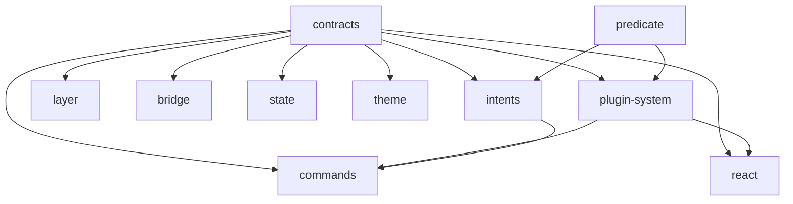

# Composition Model

## Design Philosophy

Ghost Shell is composed from independent subsystems, each in its own `@ghost-shell/*` package. There is no monolithic `createGhostShell()` function — the shell host wires subsystems together based on its needs. This DI-agnostic design means the shell works with any dependency injection approach (or none at all).

## Subsystem Independence

Each package has a clear creation function and minimal dependencies:

```
@ghost-shell/state          createInitialShellContextState()
@ghost-shell/plugin-system  createCapabilityRegistry(), createContextContributionRegistry()
@ghost-shell/theme          deriveFullPalette(), injectThemeVariables()
@ghost-shell/layer          new LayerRegistry()
@ghost-shell/intents        createIntentRuntime(deps)
@ghost-shell/commands       buildActionSurface(), createKeybindingService(options)
@ghost-shell/bridge         createWindowBridge(channelName), createDragSessionBroker(bridge, windowId)
@ghost-shell/react          createReactPartRenderer(registry?)
```

## Composition Pattern

A typical shell host composes subsystems like this:

```typescript
// 1. State
const state = createInitialShellContextState();

// 2. Plugin system
const capabilityRegistry = createCapabilityRegistry(() => pluginSnapshots);
const contextRegistry = createContextContributionRegistry();

// 3. Theme
const palette = deriveFullPalette(activeTheme.palette);
injectThemeVariables(palette);

// 4. Layer system
const layerRegistry = new LayerRegistry();
layerRegistry.setLayerHost(document.getElementById("layers")!);
layerRegistry.registerBuiltinLayers();

// 5. Intent system
const intentRuntime = createIntentRuntime({
  getRegistrySnapshot: () => ({ plugins: pluginSnapshots }),
});

// 6. Command system
const actionSurface = buildActionSurface(enabledContracts);
const keybindingService = createKeybindingService({
  actionSurface,
  intentRuntime,
});

// 7. Bridge (multi-window)
const bridge = createWindowBridge("ghost-shell");
const dndBroker = createDragSessionBroker(bridge, windowId);

// 8. Renderers
const reactRenderer = createReactPartRenderer(contextRegistry);
const vanillaRenderer = createVanillaDomRenderer();
// Register both with PartRendererRegistry
```

## Dependency Graph



Key observations:
- `@ghost-shell/contracts` is the foundation — every package depends on it
- `@ghost-shell/state` has zero runtime dependencies beyond contracts
- `@ghost-shell/bridge` is fully independent of the plugin system
- `@ghost-shell/theme` is fully independent of the plugin system
- `@ghost-shell/commands` depends on both `plugin-system` (for predicate matching) and `intents` (for dispatch)

## Sensible Defaults

Each subsystem provides sensible defaults so the host only configures what it needs to customize:

| Subsystem | Default Behavior |
|---|---|
| State | Single tab, single group, tabs placement strategy |
| Theme | `DEFAULT_DARK_PALETTE` with full derivation |
| Layer | 7 built-in layers with standard z-ordering |
| Intents | Predicate-based when-matcher |
| Commands | Plugin keybindings layer, no user overrides |
| Bridge | BroadcastChannel transport, 60s DnD TTL |
| Renderer | React renderer checks Symbol first, vanilla DOM as fallback |

## DI-Agnostic Design

The subsystems use constructor injection via options objects, not a DI container:

```typescript
// IntentRuntime needs a registry snapshot provider
createIntentRuntime({
  getRegistrySnapshot: () => ({ plugins: [...] }),
});

// KeybindingService needs an action surface and intent runtime
createKeybindingService({
  actionSurface,
  intentRuntime,
  matcher: customMatcher,  // optional
});
```

This means:
- No global singleton registry
- No service locator pattern
- No framework-specific DI (no Angular injectors, no React context for wiring)
- Easy to test — pass mock dependencies directly

## Plugin Mount Context

When a plugin part is mounted, it receives a `PluginMountContext` with access to runtime services:

```typescript
export interface PluginMountContext {
  part: { id: string; title: string; component: string };
  instanceId: string;
  definitionId: string;
  args: Record<string, string>;
  runtime: {
    services: PluginServices;
  };
}

export interface PluginServices {
  getService<T = unknown>(id: string): T | null;
  hasService(id: string): boolean;
}
```

The shell host registers services by ID; plugins consume them by ID. This is the only service-locator-like pattern, and it's scoped to the plugin boundary.

## Extension Points

- **Custom subsystem implementations**: Replace any subsystem with a compatible implementation (e.g., a different bridge transport).
- **Additional services**: Register shell services that plugins can consume via `PluginServices`.
- **Composition hooks**: The host controls the composition order and can inject middleware between subsystems.

## File Reference

| File | Responsibility |
|---|---|
| `packages/plugin-contracts/src/plugin-services.ts` | `PluginMountContext`, `PluginServices` |
| `packages/plugin-system/src/capability-registry.ts` | `createCapabilityRegistry` |
| `packages/plugin-system/src/context-contribution-registry.ts` | `createContextContributionRegistry` |
| `packages/state/src/state.ts` | `createInitialShellContextState` |
| `packages/intents/src/intent-runtime.ts` | `createIntentRuntime` |
| `packages/commands/src/keybinding-service.ts` | `createKeybindingService` |
| `packages/bridge/src/window-bridge.ts` | `createWindowBridge` |
| `packages/react/src/react-part-renderer.ts` | `createReactPartRenderer` |
