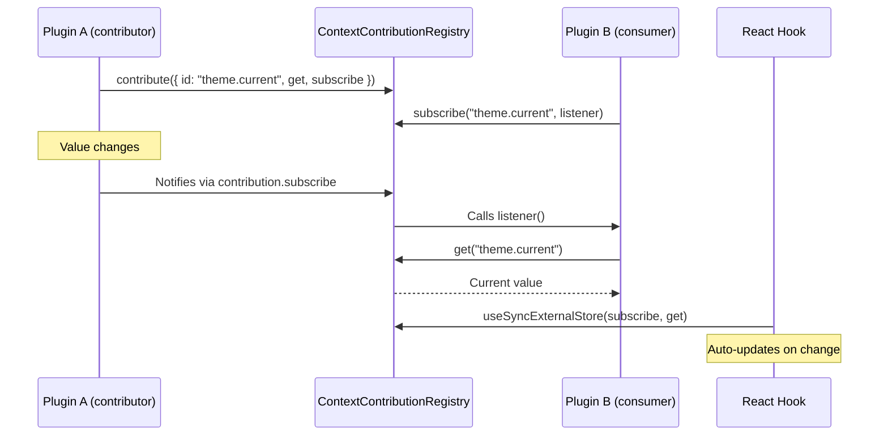

# Context System

## Design Philosophy

The context system provides framework-agnostic reactive state sharing between plugins and the shell. Plugins contribute named values with change notification; other plugins and shell components subscribe to those values. The system is deliberately decoupled from React Context — it works with any framework via a simple `get`/`subscribe` protocol compatible with `useSyncExternalStore`.

## Key Packages

- **`@ghost-shell/contracts`** — `ContextContribution<T>`, `ProviderContribution`, `ContextApi`, `ContextContributionRegistry`
- **`@ghost-shell/plugin-system`** — `createContextContributionRegistry()` implementation
- **`@ghost-shell/react`** — `useContextValue()`, `createContextHook()` React hooks

## Core Types

### ContextContribution

A reactive value that any plugin can contribute:

```typescript
// packages/plugin-contracts/src/context-contribution.ts
export interface ContextContribution<T = unknown> {
  readonly id: string;
  get(): T;
  subscribe(listener: () => void): Disposable | (() => void);
}
```

### ContextApi

Plugin-facing API for contributing and reading context:

```typescript
// packages/plugin-contracts/src/context-contribution-registry.ts
export interface ContextApi {
  contribute<T>(contribution: ContextContribution<T>): Disposable;
  get<T>(id: string): T | undefined;
  subscribe(id: string, listener: () => void): Disposable;
}
```

### ContextContributionRegistry

Shell-internal extension with provider lifecycle management:

```typescript
export interface ContextContributionRegistry extends ContextApi {
  contributeProvider(contribution: ProviderContribution): Disposable;
  getProviders(): readonly ProviderContribution[];
  subscribeProviders(listener: () => void): Disposable;
  removeByPlugin(pluginId: string): void;
}
```

### ProviderContribution

React providers that auto-compose around plugin roots:

```typescript
export interface ProviderContribution {
  readonly id: string;
  readonly order: number;  // lower = outermost
  readonly Provider: unknown;  // ComponentType<{children}> at runtime
}
```

## Data Flow



## Implementation

The registry (`packages/plugin-system/src/context-contribution-registry.ts`) maintains:

- **`entries`**: `Map<string, ContextEntry>` — contributed values keyed by ID
- **`providers`**: `ProviderEntry[]` — sorted by order
- **`contextListeners`**: `Map<string, Set<() => void>>` — per-key change listeners
- **`providerListeners`**: `Set<() => void>` — provider list change listeners

Key behaviors:
- Contributing a value with an existing ID replaces it and notifies listeners
- `removeByPlugin(pluginId)` cleans up all contributions and providers for a deactivated plugin
- Provider snapshots are lazily cached and invalidated on mutation

## React Integration

### useContextValue

Subscribes to a context value using `useSyncExternalStore` for concurrent-safe reads:

```typescript
// packages/react/src/hooks.ts
export function useContextValue<T>(id: string): T | undefined {
  const { contextRegistry } = useGhostApi();
  return useSyncExternalStore(
    (onStoreChange) => {
      if (!contextRegistry) return () => {};
      const disposable = contextRegistry.subscribe(id, onStoreChange);
      return () => disposable.dispose();
    },
    () => contextRegistry?.get<T>(id),
  );
}
```

### createContextHook

Factory for pre-typed hooks:

```typescript
export function createContextHook<T>(id: string): () => T | undefined {
  return function useTypedContext(): T | undefined {
    return useContextValue<T>(id);
  };
}

// Usage:
// export const useActiveTheme = createContextHook<Theme>("ghost.context.activeTheme");
```

## Provider Composition

When the React renderer mounts a plugin part, it wraps the component tree with all contributed providers. Providers are sorted by `order` — lowest order is outermost:

```
ProviderA (order: 0)        ← outermost
  ProviderB (order: 10)
    GhostContext.Provider
      PluginComponent       ← innermost
```

The renderer subscribes to provider list changes and re-renders when providers are added or removed.

## Extension Points

- **Context contributions**: Any plugin can contribute reactive values via `ActivationContext.context.contribute()`.
- **Provider contributions**: Plugins can wrap all React plugin roots with custom providers (e.g., for i18n, feature flags).
- **Custom consumers**: Non-React code can use `registry.get()` and `registry.subscribe()` directly.

## File Reference

| File | Responsibility |
|---|---|
| `packages/plugin-contracts/src/context-contribution.ts` | `ContextContribution`, `ProviderContribution` |
| `packages/plugin-contracts/src/context-contribution-registry.ts` | `ContextApi`, `ContextContributionRegistry` |
| `packages/plugin-system/src/context-contribution-registry.ts` | Implementation |
| `packages/react/src/hooks.ts` | `useContextValue`, `createContextHook` |
| `packages/react/src/react-part-renderer.ts` | Provider composition in mount |
