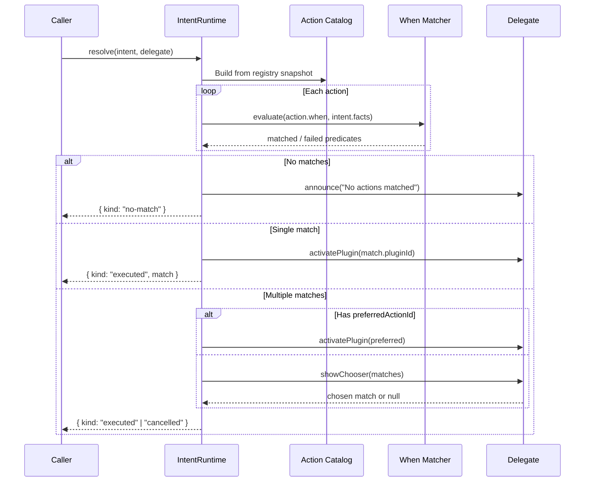

# Intent System

## Design Philosophy

The intent system provides indirect action routing. Instead of directly calling a function, code fires an intent (e.g., `"open-file"`) with a fact bag. The runtime matches the intent against all registered actions using when-clause predicates, then either auto-executes (single match), shows a chooser (multiple matches), or reports no match. This decouples action producers from action consumers.

## Key Package

**`@ghost-shell/intents`** — Intent runtime, when-clause matchers, action catalog builder.

## Core Types

### ShellIntent

An intent is a type string plus a bag of facts:

```typescript
// packages/intents/src/intent-runtime.ts
export interface ShellIntent {
  type: string;
  facts: IntentFactBag;
}
```

### RuntimeActionDescriptor

Actions registered from plugin manifests:

```typescript
export interface RuntimeActionDescriptor {
  pluginId: string;
  pluginName: string;
  actionId: string;
  title: string;
  handler: string;
  intentType: string;
  when: Record<string, unknown>;
  loadMode: string;
  registrationOrder: number;
}
```

### IntentResolution

The resolution result is a discriminated union:

```typescript
export type IntentResolution =
  | { kind: "no-match"; feedback: string; matches: [] }
  | { kind: "single-match"; feedback: string; matches: [IntentActionMatch] }
  | { kind: "multiple-matches"; feedback: string; matches: IntentActionMatch[] };
```

### IntentRuntime

The high-level runtime with delegate-based execution:

```typescript
export interface IntentRuntime {
  resolve(
    intent: ShellIntent,
    delegate: IntentResolutionDelegate,
    options?: { preferredActionId?: string },
  ): Promise<IntentResolutionOutcome>;
}

export type IntentResolutionOutcome =
  | { kind: "executed"; match: IntentActionMatch; trace: IntentResolutionTrace }
  | { kind: "no-match"; feedback: string; trace: IntentResolutionTrace }
  | { kind: "cancelled"; trace: IntentResolutionTrace };
```

## Resolution Flow



## When-Clause Evaluation

Actions declare `when` predicates in their manifest:

```typescript
// In plugin manifest
{
  id: "open-in-editor",
  title: "Open in Editor",
  intent: "open-file",
  when: { "file.extension": "ts" }
}
```

The `IntentWhenMatcher` evaluates predicates against the intent's fact bag:

```typescript
// packages/intents/src/matcher/contracts.ts
export interface IntentWhenMatcher {
  evaluate(
    when: Record<string, unknown>,
    facts: IntentFactBag,
  ): PredicateEvaluationResult;
}

export interface PredicateEvaluationResult {
  matched: boolean;
  failedPredicates: PredicateFailureTrace[];
}
```

Two matcher implementations:
- **`createDefaultIntentWhenMatcher()`** — Simple key-value equality matching
- **`createPredicateWhenMatcher()`** — Full predicate engine integration via `@ghost-shell/predicate`

## Action Catalog

The catalog is built from the plugin registry snapshot at resolution time:

```typescript
export function createActionCatalogFromRegistrySnapshot(snapshot: {
  plugins: { id: string; enabled: boolean; loadMode: string; contract: PluginContract | null }[];
}): RuntimeActionDescriptor[];
```

This reads `contributes.actions` from each enabled plugin's contract and flattens them into a sorted list.

## Resolution Delegate

The delegate separates UI concerns from resolution logic:

```typescript
export interface IntentResolutionDelegate {
  showChooser(matches: IntentActionMatch[], intent: ShellIntent, trace: IntentResolutionTrace): Promise<IntentActionMatch | null>;
  activatePlugin(pluginId: string, trigger: { type: string; id: string }): Promise<boolean>;
  announce(message: string): void;
}
```

## Tracing

Every resolution produces a full trace for debugging:

```typescript
export interface IntentResolutionTrace {
  intentType: string;
  evaluatedAt: number;
  actions: IntentActionTrace[];
  matched: IntentActionMatch[];
}

export interface IntentActionTrace extends RuntimeActionDescriptor {
  intentTypeMatch: boolean;
  predicateMatched: boolean;
  failedPredicates: PredicateFailureTrace[];
}
```

## Extension Points

- **Plugin actions**: Declare actions with `intent` and `when` in the plugin manifest.
- **Custom when-matchers**: Provide an `IntentWhenMatcher` to the runtime for custom predicate evaluation.
- **Resolution delegates**: Implement `IntentResolutionDelegate` to customize chooser UI and plugin activation.

## File Reference

| File | Responsibility |
|---|---|
| `packages/intents/src/intent-runtime.ts` | `IntentRuntime`, `resolveIntent`, `createIntentRuntime` |
| `packages/intents/src/matcher/contracts.ts` | `IntentWhenMatcher`, `IntentFactBag` |
| `packages/intents/src/matcher/default-when-matcher.ts` | Simple equality matcher |
| `packages/intents/src/matcher/predicate-when-matcher.ts` | Predicate engine matcher |
