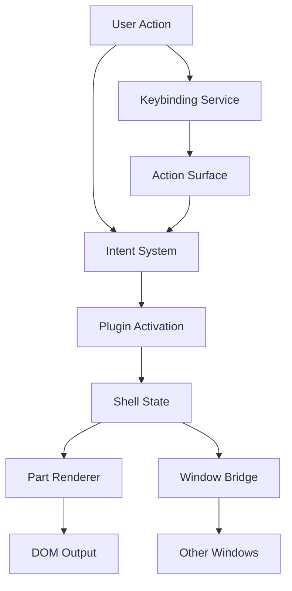

# Ghost Shell — System Overview

## Design Philosophy

Ghost Shell is a VS Code-inspired plugin shell for building composable, multi-window web applications. It provides a library-first architecture where every subsystem is a standalone `@ghost-shell/*` package that can be used independently or composed into a full shell runtime.

The system is designed around four key principles:

1. **Headless core** — All state management, intent resolution, and plugin lifecycle logic runs without any DOM dependency. UI is a rendering concern layered on top.
2. **Renderer-agnostic** — The shell delegates rendering to a `PartRenderer` protocol. React, vanilla DOM, or any future framework can participate equally.
3. **Framework-agnostic context** — The `ContextContributionRegistry` provides reactive state sharing without coupling to React Context, Svelte stores, or any specific framework primitive.
4. **TypeScript-first** — Every contract is expressed as a TypeScript interface. Plugin manifests use `const` generics for literal type inference, enabling compile-time validation of part IDs and action IDs.

## Package Ecosystem

```
@ghost-shell/contracts      Plugin-facing type contracts (PluginContract, PartRenderer, GhostApi)
@ghost-shell/plugin-system  Capability registry, contribution composition, predicate evaluation
@ghost-shell/state          Pure functional dock tree, tabs, selection, lanes, workspaces
@ghost-shell/theme          Design token derivation, CSS variable injection, persistence
@ghost-shell/layer          Wayland-inspired layer system with anchor positioning
@ghost-shell/intents        Intent-based action routing with when-clause evaluation
@ghost-shell/commands       Action surface, keybinding resolver, chord normalization
@ghost-shell/bridge         Cross-window BroadcastChannel communication, DnD session broker
@ghost-shell/react          React renderer, GhostProvider, context hooks
@ghost-shell/persistence    Layout/keybinding/context serialization and sanitization
@ghost-shell/federation     Module Federation runtime mount utilities
@ghost-shell/predicate      Query predicate compiler and evaluator
@ghost-shell/arbiter        Rete-based rule engine for complex state derivation
```

## Architecture Layers

```
┌─────────────────────────────────────────────────────────┐
│                    Plugin Modules                        │
│  (React components, vanilla DOM mount fns, services)    │
├─────────────────────────────────────────────────────────┤
│                   Plugin Contracts                       │
│  definePlugin() · PluginContract · GhostApi · Events    │
├──────────────┬──────────────┬───────────────────────────┤
│  Renderer    │  Intent      │  Command                  │
│  Protocol    │  System      │  System                   │
│  (react,     │  (routing,   │  (actions,                │
│   vanilla)   │   when-      │   keybindings,            │
│              │   clauses)   │   menus)                  │
├──────────────┴──────────────┴───────────────────────────┤
│                   Core Services                         │
│  State · Theme · Layer · Context · Bridge · Persistence │
├─────────────────────────────────────────────────────────┤
│                   Foundation                            │
│  Predicate engine · Arbiter rule engine · Federation    │
└─────────────────────────────────────────────────────────┘
```

## Data Flow



## Key Design Decisions

### Plugin Manifest as Data

Plugin contracts are plain objects validated at registration time, not class hierarchies. The `definePlugin()` helper preserves literal types via `const` generics:

```typescript
export function definePlugin<const T extends PluginContract>(manifest: T): T {
  return manifest;
}
```

This means part IDs like `"editor"` are inferred as the literal string `"editor"`, not widened to `string`.

### Immutable State Updates

All state in `@ghost-shell/state` is updated via pure functions that return new state objects. There is no mutable store — the shell host owns the state reference and applies updates.

### Capability-Based Plugin Dependencies

Plugins declare provided capabilities (components, services) with semver versions and depend on them via version ranges. The `CapabilityRegistry` validates the dependency graph at activation time.

### Separation of Contracts and Implementation

`@ghost-shell/contracts` contains only TypeScript interfaces and type-level helpers. Implementation lives in `@ghost-shell/plugin-system`, `@ghost-shell/react`, etc. This ensures plugins depend only on stable type contracts, not shell internals.

## Extension Points

| Extension Point | Package | Mechanism |
|---|---|---|
| Plugin parts (UI) | `contracts` | `PluginPartContribution` in manifest |
| Actions & menus | `contracts` | `PluginActionContribution`, `PluginMenuContribution` |
| Keybindings | `commands` | `PluginKeybindingContribution` with when-clauses |
| Themes | `theme` | `ThemeContribution` with partial palette |
| Layer surfaces | `layer` | `PluginLayerSurfaceContribution` |
| Custom layers | `layer` | `PluginLayerDefinition` |
| Context values | `plugin-system` | `ContextContribution<T>` |
| React providers | `plugin-system` | `ProviderContribution` |
| Capabilities | `plugin-system` | `PluginProvidedCapabilities` |
| Placement strategies | `state` | `TabPlacementStrategy` |
| Edge slots | `contracts` | `PluginSlotContribution` |
| Sections | `contracts` | `PluginSectionContribution` |

## Related Docs

- [Plugin System](./plugin-system.md)
- [Renderer Protocol](./renderer-protocol.md)
- [State Management](./state-management.md)
- [Context System](./context-system.md)
- [Theme System](./theme-system.md)
- [Layer System](./layer-system.md)
- [Intent System](./intent-system.md)
- [Command System](./command-system.md)
- [Bridge System](./bridge-system.md)
- [Composition Model](./composition-model.md)
