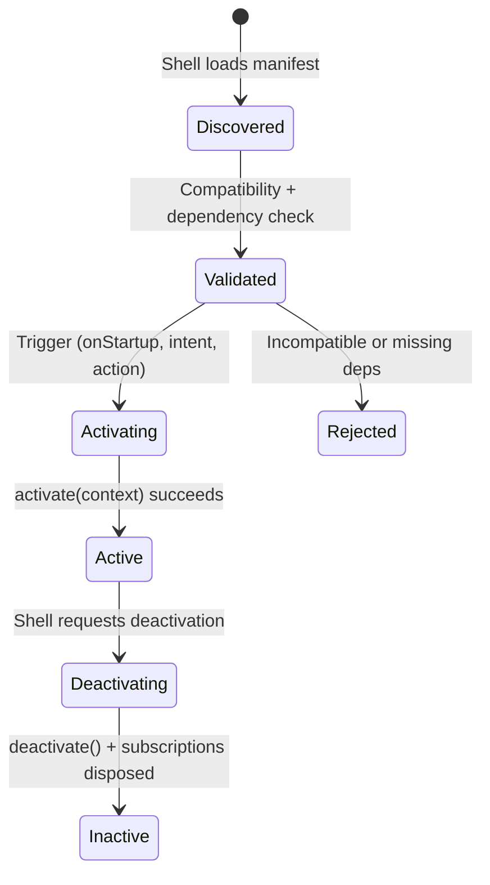

# Plugin System

## Design Philosophy

The plugin system follows a declarative, data-driven model inspired by VS Code's extension system. Plugins declare their contributions (parts, actions, themes, capabilities) in a typed manifest object. The shell discovers, validates, activates, and deactivates plugins based on this manifest — plugins never directly mutate shell state.

## Key Packages

- **`@ghost-shell/contracts`** — `PluginContract`, `definePlugin()`, `GhostApi`, `ActivationContext`
- **`@ghost-shell/plugin-system`** — `CapabilityRegistry`, contribution composition, predicate evaluation, context registry

## Plugin Manifest

Every plugin is defined via `definePlugin()`, which preserves literal types:

```typescript
// packages/plugin-contracts/src/define-plugin.ts
export function definePlugin<const T extends PluginContract>(manifest: T): T {
  return manifest;
}
```

The `PluginContract` shape:

```typescript
// packages/plugin-contracts/src/types.ts
export interface PluginContract {
  manifest: PluginManifestIdentity;
  contributes?: PluginContributions | undefined;
  dependsOn?: PluginDependencies | undefined;
  activationEvents?: ("onStartup")[] | undefined;
}

export interface PluginManifestIdentity {
  id: string;
  name: string;
  version: string;
  icon?: string | undefined;
  gallery?: PluginGallery | undefined;
}
```

## Plugin Lifecycle



### Discovery

The shell loads plugin descriptors (typically from a tenant manifest endpoint). Each descriptor includes an entry point URL, version, and compatibility metadata.

```typescript
export interface TenantPluginDescriptor {
  id: string;
  version: string;
  entry: string;
  compatibility: PluginCompatibilityMetadata;
  pluginDependencies?: string[];
}
```

### Activation

When a plugin activates, the shell calls its `activate()` function with an `ActivationContext`:

```typescript
// packages/plugin-contracts/src/ghost-api.ts
export interface ActivationContext {
  readonly subscriptions: Disposable[];
  readonly pluginId: string;
  readonly services?: PluginServices;
  readonly context?: ContextApi;
}
```

Plugins push `Disposable` objects into `subscriptions` for automatic cleanup on deactivation.

### Deactivation

The shell calls the optional `deactivate()` function, then disposes all items in `subscriptions`. The `ContextContributionRegistry` removes all contributions for the plugin via `removeByPlugin(pluginId)`.

## Capability Registry

Plugins can provide and consume versioned capabilities (components and services):

```typescript
// packages/plugin-system/src/capability-registry.ts
export interface CapabilityRegistry {
  registerPlugin(pluginId: string, contract: PluginContract): void;
  unregisterPlugin(pluginId: string): void;
  validateDependencies(context: PluginDependencyValidationContext): CapabilityDependencyFailure[];
  resolveComponent(capabilityId: string, context: CapabilityResolutionContext): { providerPluginId: string } | null;
  resolveService(capabilityId: string, context: CapabilityResolutionContext): { providerPluginId: string } | null;
}
```

Dependencies use semver version ranges. The registry validates at activation time and produces typed failure codes:

```typescript
export type CapabilityDependencyFailureCode =
  | "MISSING_DEPENDENCY_PLUGIN"
  | "INCOMPATIBLE_DEPENDENCY_PLUGIN"
  | "MISSING_DEPENDENCY_COMPONENT"
  | "INCOMPATIBLE_DEPENDENCY_COMPONENT"
  | "MISSING_DEPENDENCY_SERVICE"
  | "INCOMPATIBLE_DEPENDENCY_SERVICE";
```

## Contribution Composition

`composeEnabledPluginContributions()` merges contributions from all enabled plugins into a single surface, applying predicate-based filtering:

```typescript
// packages/plugin-system/src/composition.ts
export function composeEnabledPluginContributions(
  sources: PluginContributionSource[],
): ComposedPluginContributions;
```

## Contribution Types

The `PluginContributions` interface supports:

| Field | Type | Purpose |
|---|---|---|
| `parts` | `PluginPartContribution[]` | UI panels/tabs |
| `actions` | `PluginActionContribution[]` | Intent-routed commands |
| `menus` | `PluginMenuContribution[]` | Context/command menus |
| `keybindings` | `PluginKeybindingContribution[]` | Keyboard shortcuts |
| `themes` | `ThemeContribution[]` | Color themes |
| `slots` | `PluginSlotContribution[]` | Edge chrome areas |
| `sections` | `PluginSectionContribution[]` | Aggregated panels |
| `layers` | `PluginLayerDefinition[]` | Custom layer definitions |
| `layerSurfaces` | `PluginLayerSurfaceContribution[]` | Surfaces on layers |
| `capabilities` | `PluginProvidedCapabilities` | Shared components/services |
| `configuration` | `PluginConfigurationContribution` | Settings schema |

## Extension Points

- **Custom capabilities**: Plugins provide components/services that other plugins consume via the `CapabilityRegistry`.
- **Predicate-gated contributions**: Actions, menus, keybindings, and layer surfaces support `when` predicates evaluated against the current fact bag.
- **Activation events**: Currently supports `"onStartup"`; intent-triggered activation is handled by the intent runtime.

## File Reference

| File | Responsibility |
|---|---|
| `packages/plugin-contracts/src/types.ts` | All manifest type definitions |
| `packages/plugin-contracts/src/define-plugin.ts` | `definePlugin()` helper |
| `packages/plugin-contracts/src/ghost-api.ts` | `GhostApi`, `ActivationContext` |
| `packages/plugin-system/src/capability-registry.ts` | Capability registration and validation |
| `packages/plugin-system/src/composition.ts` | Contribution merging |
| `packages/plugin-system/src/compatibility.ts` | Shell/plugin version compatibility |
| `packages/plugin-system/src/predicate.ts` | Contribution predicate evaluation |
