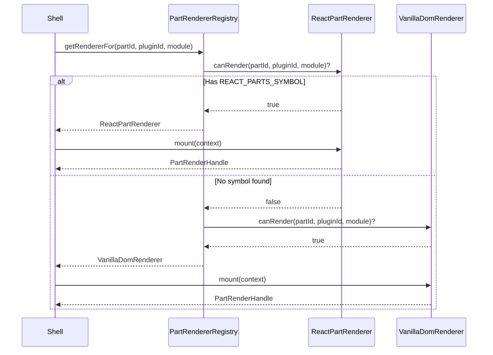

# Renderer Protocol

## Design Philosophy

Ghost Shell decouples plugin UI rendering from the shell core via a `PartRenderer` protocol. The shell never directly creates React roots or manipulates plugin DOM — it delegates to registered renderers that understand specific module formats. This enables framework-agnostic plugin development: a plugin can ship React components, vanilla DOM mount functions, or any future framework.

## Key Types

### PartRenderer

The core protocol that every renderer implements:

```typescript
// packages/plugin-contracts/src/part-renderer.ts
export interface PartRenderer {
  readonly id: string;
  canRender(partId: string, pluginId: string, module: unknown): boolean;
  mount(context: PartRenderContext): PartRenderHandle;
}
```

### PartRenderContext

Renderer-agnostic context passed when mounting a part:

```typescript
export interface PartRenderContext {
  readonly container: HTMLElement;
  readonly mountContext: PluginMountContext;
  readonly partId: string;
  readonly pluginId: string;
  readonly module: unknown;
}
```

### PartRenderHandle

Lifecycle handle returned by `mount()`:

```typescript
export interface PartRenderHandle extends Disposable {
  update?(context: PartRenderContext): void;
}
```

### PartRendererRegistry

The shell uses this to dispatch mount calls:

```typescript
export interface PartRendererRegistry {
  register(renderer: PartRenderer): Disposable;
  getRendererFor(partId: string, pluginId: string, module: unknown): PartRenderer | undefined;
  readonly renderers: readonly PartRenderer[];
}
```

## Renderer Dispatch Flow



## Symbol-Based Detection

React plugin modules are identified by a unique Symbol, avoiding fragile duck-typing:

```typescript
// packages/plugin-contracts/src/define-parts.ts
export const REACT_PARTS_SYMBOL: unique symbol = Symbol.for("ghost-shell.react-parts");

export interface ReactPartsModule {
  readonly [REACT_PARTS_SYMBOL]: true;
  readonly components: Record<string, unknown>;
  readonly manifest?: unknown;
}

export function isReactPartsModule(mod: unknown): mod is ReactPartsModule {
  return typeof mod === "object" && mod !== null && REACT_PARTS_SYMBOL in mod;
}
```

## Module Federation Unwrapping

MF exposes return the file's exports as an object, so the Symbol may live on a named export rather than the module object itself. The React renderer handles this:

```typescript
// packages/react/src/react-part-renderer.ts
export function findReactPartsModule(module: unknown): ReactPartsModule | undefined {
  if (isReactPartsModule(module)) return module;
  if (typeof module !== "object" || module === null) return undefined;
  for (const value of Object.values(module as Record<string, unknown>)) {
    if (isReactPartsModule(value)) return value;
  }
  return undefined;
}
```

## Built-in Renderers

### React Part Renderer

Created via `createReactPartRenderer()` from `@ghost-shell/react`. Wraps each component in a `GhostProvider` and contributed context providers:

```typescript
export function createReactPartRenderer(
  registry?: ContextContributionRegistry,
): PartRenderer {
  return {
    id: "react",
    canRender(_partId, _pluginId, module) {
      return findReactPartsModule(module) !== undefined;
    },
    mount(context) {
      // Creates React root, wraps with GhostContext.Provider
      // and contributed ProviderContributions (lowest order = outermost)
    },
  };
}
```

### Vanilla DOM Renderer

Created via `createVanillaDomRenderer()` from `@ghost-shell/contracts`. Supports multiple mount function conventions:

- `module.mountPart(container, context)`
- `module.parts[partId].mount(container, context)`
- `module.parts[partId](container, context)`
- `module.default(container, context)`

The return value is normalized: a function is treated as a cleanup callback, an object with `dispose()` is treated as a `Disposable`.

```typescript
// packages/plugin-contracts/src/vanilla-dom-renderer.ts
export function createVanillaDomRenderer(): PartRenderer {
  return {
    id: "vanilla-dom",
    canRender(partId, _pluginId, module) {
      if (containsReactParts(module)) return false;
      return resolveVanillaMountFn(module, partId) !== undefined;
    },
    mount(context) { /* ... */ },
  };
}
```

## Extension Points

- **Custom renderers**: Register a `PartRenderer` with the `PartRendererRegistry` to support new frameworks (Svelte, Vue, Web Components, etc.).
- **Provider composition**: React renderer auto-wraps with `ProviderContribution` instances from the `ContextContributionRegistry`.

## File Reference

| File | Responsibility |
|---|---|
| `packages/plugin-contracts/src/part-renderer.ts` | `PartRenderer`, `PartRendererRegistry` interfaces |
| `packages/plugin-contracts/src/define-parts.ts` | `REACT_PARTS_SYMBOL`, `ReactPartsModule` |
| `packages/plugin-contracts/src/vanilla-dom-renderer.ts` | Vanilla DOM renderer implementation |
| `packages/react/src/react-part-renderer.ts` | React renderer with provider composition |
