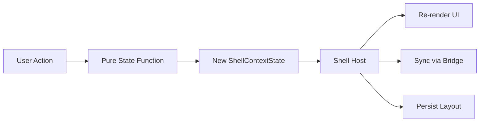

# State Management

## Design Philosophy

`@ghost-shell/state` implements pure functional state management for the shell's layout and context. Every state transition is a pure function: `(state, input) => newState`. There is no mutable store, no observable, no framework coupling. The shell host owns the state reference and decides when/how to apply updates and notify subscribers.

## Core State Shape

```typescript
// packages/state/src/types.ts
export interface ShellContextState {
  groups: Record<string, ContextGroup>;
  tabs: Record<string, ContextTab>;
  tabOrder: TabInstanceId[];
  activeTabId: TabInstanceId | null;
  dockTree: DockTreeState;
  closedTabHistory: ClosedTabHistoryEntry[];
  globalLanes: Record<string, ContextLaneValue>;
  groupLanes: Record<string, Record<string, ContextLaneValue>>;
  subcontextsByTab: Record<string, Record<string, ContextLaneValue>>;
  selectionByEntityType: Record<string, EntityTypeSelection>;
}
```

## Dock Tree

The dock tree is a binary tree of splits and stacks, representing the tiling layout:

```typescript
// packages/state/src/dock-tree-types.ts
export type DockNode = DockSplitNode | DockStackNode;

export interface DockSplitNode {
  kind: "split";
  id: string;
  orientation: DockOrientation;  // "horizontal" | "vertical"
  ratio?: number;
  first: DockNode;
  second: DockNode;
}

export interface DockStackNode {
  kind: "stack";
  id: string;
  tabIds: string[];
  activeTabId: string | null;
  navHistory?: { back: string[]; forward: string[] };
}

export interface DockTreeState {
  root: DockNode | null;
}
```

### Dock Tree Operations

All operations return new state — never mutate:

```
createInitialDockTree(tabId)          → DockTreeState
applyDockTabDrop(state, input)        → ShellContextState
removeTabFromDockTree(tree, tabId)    → DockTreeState
moveTabWithinDockTree(tree, ...)      → DockTreeState
setDockSplitRatioById(tree, id, r)    → DockTreeState
```

Directional commands for keyboard-driven navigation:

```
focusActiveTabInDirection(state, dir)  → ShellContextState
moveActiveTabInDirection(state, dir)   → ShellContextState
swapActiveTabInDirection(state, dir)   → ShellContextState
resizeNearestSplitInDirection(...)     → ShellContextState
```

## Data Flow



## Tabs and Groups

Tabs belong to groups. Groups provide color-coded visual grouping and scoped context lanes:

```typescript
export interface ContextTab {
  id: string;
  definitionId: string;
  groupId: string;
  label: string;
  closePolicy: ContextTabClosePolicy;  // "fixed" | "closeable"
  args: Record<string, string>;
}

export interface ContextGroup {
  id: string;
  color: string;
}
```

Tab operations: `openPartInstance`, `closeTab`, `registerTab`, `setActiveTab`, `moveTabToGroup`, `moveTabBeforeTab`.

## Selection

Entity-type-scoped selection with priority ID for single-item focus:

```typescript
export interface EntityTypeSelection {
  selectedIds: string[];
  priorityId: string | null;
}
```

Selection updates can trigger propagation rules and derived lane computation:

```typescript
export interface SelectionUpdateResult {
  state: ShellContextState;
  changedEntityTypes: string[];
  derivedLaneFailures: string[];
}
```

## Lanes

Lanes are key-value context channels scoped to global, group, or tab level:

```typescript
export interface ContextLaneValue {
  value: string;
  revision: RevisionMeta;
  valueType?: string;
  sourceSelection?: { entityType: string; revision: RevisionMeta };
}
```

Operations: `readGlobalLane`, `writeGlobalLane`, `readGroupLaneForTab`, `writeGroupLaneByGroup`, `writeGroupLaneByTab`, `writeTabSubcontext`.

## Placement Strategies

Placement strategies control how new tabs are inserted into the dock tree:

```typescript
// packages/state/src/placement-strategy/types.ts
export interface TabPlacementStrategy {
  readonly id: PlacementStrategyId;  // "tabs" | "dwindle" | "stack"
  place(ctx: PlacementContext): PlacementResult;
  onTabClosed?(ctx: { tabId: string; stackId: string; tree: DockTreeState }): DockTreeState;
  navigateBack?(stackId: string, tree: DockTreeState): { tree: DockTreeState; activatedTabId?: string } | null;
  navigateForward?(stackId: string, tree: DockTreeState): { tree: DockTreeState; activatedTabId?: string } | null;
}
```

Built-in strategies:
- **tabs** — All tabs in a single stack (traditional tabbed UI)
- **dwindle** — Binary split tiling (like bspwm/Hyprland dwindle)
- **stack** — Each tab gets its own stack

The `PlacementStrategyRegistry` allows runtime switching between strategies.

## Workspaces

Workspaces provide named, switchable state containers:

```typescript
// packages/state/src/workspace-types.ts
export interface Workspace {
  id: string;
  name: string;
  state: ShellContextState;
}

export interface WorkspaceManagerState {
  workspaces: Workspace[];
  activeWorkspaceId: string;
}
```

Operations: `createWorkspace`, `switchWorkspace`, `deleteWorkspace`, `renameWorkspace`, `moveTabToWorkspace`.

## Extension Points

- **Placement strategies**: Implement `TabPlacementStrategy` and register via `PlacementStrategyRegistry`.
- **Selection propagation rules**: Define `SelectionPropagationRule` to cascade selection changes across entity types.
- **Derived lanes**: Define `DerivedLaneDefinition` to auto-compute lane values from selection state.

## File Reference

| File | Responsibility |
|---|---|
| `packages/state/src/types.ts` | Core state types |
| `packages/state/src/dock-tree-types.ts` | Dock tree node types |
| `packages/state/src/dock-tree.ts` | Dock tree CRUD operations |
| `packages/state/src/dock-tree-commands.ts` | Directional navigation commands |
| `packages/state/src/tabs-groups.ts` | Tab/group management |
| `packages/state/src/selection.ts` | Entity selection |
| `packages/state/src/lanes.ts` | Context lane read/write |
| `packages/state/src/workspace.ts` | Workspace management |
| `packages/state/src/placement-strategy/` | Placement strategy implementations |
| `packages/state/src/state.ts` | `createInitialShellContextState()` |
