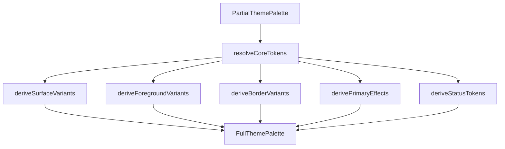

# Theme System

## Design Philosophy

The theme system provides a complete design token pipeline: plugins contribute partial palettes, the derivation engine fills in missing tokens, and the result is injected as `--ghost-*` CSS custom properties. This ensures visual consistency across independently developed plugins while allowing deep customization.

## Key Package

**`@ghost-shell/theme`** — Palette derivation, CSS variable injection, persistence, background image management.

## Ghost Design Tokens

Every color in the system is a `--ghost-*` CSS custom property. The full palette contains 80+ tokens organized into groups:

```typescript
// packages/theme/src/css-vars.ts (excerpt)
export const GHOST_THEME_CSS_VARS: Readonly<Record<keyof FullThemePalette, string>> = {
  background: "--ghost-background",
  foreground: "--ghost-foreground",
  surface: "--ghost-surface",
  overlay: "--ghost-overlay",
  primary: "--ghost-primary",
  secondary: "--ghost-secondary",
  accent: "--ghost-accent",
  muted: "--ghost-muted",
  error: "--ghost-error",
  warning: "--ghost-warning",
  success: "--ghost-success",
  info: "--ghost-info",
  border: "--ghost-border",
  // ... surface variants, foreground variants, border variants,
  //     primary effects, status tokens, edge panel tokens, etc.
};
```

### Token Groups

Tokens are organized for UI display (palette preview, settings panels):

| Group | Example Tokens |
|---|---|
| Core | `background`, `foreground`, `surface`, `primary`, `accent` |
| Surface | `surfaceElevated`, `surfaceHover`, `surfaceInset` |
| Foreground | `primaryForeground`, `mutedForeground`, `dimForeground` |
| Border | `border`, `borderMuted`, `borderAccent`, `ring` |
| Primary Effects | `primaryGlow`, `primaryGlowSubtle`, `primaryOverlay` |
| Status | `error`, `errorForeground`, `warningBackground` |
| Edge Panels | `edgeTop`, `edgeTopForeground`, `edgeBottomAccent` |
| Window | `borderActive`, `borderInactive`, `opacityActive` |

## Theme Derivation Engine

Plugins contribute a `PartialThemePalette` (only the tokens they want to set). The derivation engine fills in all remaining tokens:

```typescript
// packages/theme/src/derive-palette.ts
export function deriveFullPalette(
  input: PartialThemePalette,
  terminal?: TerminalPalette | undefined,
): FullThemePalette;
```

### Derivation Pipeline



The derivation uses color utilities:
- `adjustLightness(color, amount)` — Shift lightness in OKLCH space
- `blendWithBackground(fg, bg, ratio)` — Alpha-blend two colors
- `contrastSafe(color)` — Pick black or white for readable text on the given background

## Theme Contributions

Plugins declare themes in their manifest:

```typescript
// packages/plugin-contracts/src/types.ts
export interface ThemeContribution {
  id: string;
  name: string;
  author?: string;
  mode: "dark" | "light";
  palette: PartialThemePalette;
  backgrounds?: ThemeBackgroundEntry[];
  fonts?: ThemeFonts;
  terminal?: TerminalPalette;
  preview?: string;
}
```

## CSS Variable Injection

```typescript
// packages/theme/src/theme-tokens.ts
export function injectThemeVariables(palette: FullThemePalette, target?: HTMLElement): void;
export function removeThemeVariables(target?: HTMLElement): void;
```

This sets CSS custom properties on the target element (defaults to `document.documentElement`), making all `var(--ghost-*)` references resolve to the active theme.

## Theme Persistence

User preferences are stored in localStorage:

```typescript
export function readUserThemePreference(): ThemePreferenceData | null;
export function writeUserThemePreference(data: ThemePreferenceData): void;
export function clearUserThemePreference(): void;
```

Background image preferences are managed separately with a preloading cache:

```typescript
export function resolveBackgroundUrl(url: string): Promise<string>;
export function preloadBackgroundUrls(urls: string[]): void;
export function manageBackgroundImage(options: { url: string; mode: string }): Disposable;
```

## Extension Points

- **Theme contributions**: Plugins provide `ThemeContribution` with a partial palette; the derivation engine handles the rest.
- **Background images**: Themes can include background image URLs with cover/contain/tile modes.
- **Custom fonts**: Themes can specify body, mono, and heading font families.
- **Terminal palette**: Themes can map ANSI colors for terminal integration.

## File Reference

| File | Responsibility |
|---|---|
| `packages/theme/src/css-vars.ts` | `GHOST_THEME_CSS_VARS` mapping, `THEME_TOKEN_GROUPS` |
| `packages/theme/src/derive-palette.ts` | `deriveFullPalette()` |
| `packages/theme/src/derivation-helpers.ts` | Surface, foreground, border, status derivation |
| `packages/theme/src/color-utils.ts` | OKLCH color manipulation |
| `packages/theme/src/theme-tokens.ts` | CSS variable injection |
| `packages/theme/src/theme-persistence.ts` | localStorage read/write |
| `packages/theme/src/theme-background.ts` | Background image DOM management |
| `packages/theme/src/theme-background-cache.ts` | Background URL preloading |
